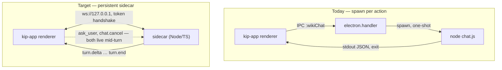

# Peck, Rebuilt — overhaul proposal

Status: **approved, tracked as issues** (2026‑09‑14). This is the design record for a
complete overhaul of Peck's underlying architecture — replacing the process model,
storage, retrieval, skill sandbox, and key custody with the design from two source
documents (*ADD‑1: Architectural Design Document* and *SPEC‑1: Requirements &
Specification* for a "Personal Knowledge‑Agent Harness"), while keeping every bit of
Peck's proven *behavior*.

An interactive, visually laid-out version of this document (with before/after diagrams)
is published at:
<https://claude.ai/code/artifact/2290b7f2-90af-45f1-a1ce-728b97187019>

The actual work is tracked as GitHub issues:

| Repo | Milestones | Issues |
|---|---|---|
| `kip` | P0 – P7 | [#67–#79](https://github.com/JWE24-code/kip/milestones) |
| `kip-app` | P8 — App integration | [#147](https://github.com/JWE24-code/kip-app/issues/147) |
| `kip-backend` | P7 — Provider & cost (backend) | [#97](https://github.com/JWE24-code/kip-backend/issues/97) |
| `kip-pwa` | P7 — Provider & cost (PWA) | [#62](https://github.com/JWE24-code/kip-pwa/issues/62) |

This document is the *why*; the issues above are the *what*.

## 1. What "overhaul" means here

Peck today is a mature, well-tested, synchronous pipeline: a CLI or IPC call runs
`peckTurn()`, which classifies the input, searches a SQLite FTS5 index, asks an LLM, and
writes straight into `nest/`. The harness design describes something structurally
different: a persistent sidecar holding a WebSocket connection, a model-driven
tool-calling loop, a git-versioned agent workspace separate from the vault, a sandboxed
skill layer, and server-side key custody (with BYOK as a confirmed, permanent exception —
see §6).

Six axes of infrastructure get replaced outright. The retrieval *logic* Peck already got
right is a separate question (§2).

| Axis | Today | Target |
|---|---|---|
| Process model | Spawn-per-action, JSON over stdout, exit | One persistent sidecar per app session, WebSocket, real turn lifecycle |
| Storage | `.roost/meta.db` inside the (possibly Dropbox-synced) coop | Index + future git workspace relocated outside any synced path |
| Retrieval | FTS5 lexical search only, no embeddings | Hybrid FTS5 + sqlite-vec, merged by reciprocal rank fusion |
| Sandbox | Skills run via unsandboxed `execFile`, full FS + network | Manifest-declared capabilities, `network:none` default, enforced resource limits |
| Key custody | Plaintext `.henhouse/llm.json`, managed backend hidden/invite-only | BYOK stays first-class and unmetered; managed backend becomes visible and optional |
| Liveness | Fully manual Hatch, no watcher | chokidar watcher + boot reconcile, ~1s reflection |

## 2. What survives the rebuild, and what doesn't

"Complete overhaul" doesn't mean re-deriving fixes from the harness design's prose that
Peck already made and tested against real bug reports.

| Verdict | Piece of Peck | Why |
|---|---|---|
| **Keep** | Index-first selection, multi-hop link expansion, dead-citation detection, groom-conflict injection (`kip-app#106` / `#117` / `#116`) | Hard-won correctness fixes tied to real bug reports. Re-deriving retrieval logic from the design doc alone re-introduces bugs already closed once. |
| **Keep** | `resolvePage` / `findSimilarSlug` dedup + dated-append write pattern | Already matches the harness's "never a raw overwrite" write-safety rule exactly. |
| **Keep** | `lib/llm.js` provider abstraction | Same idea as the harness's swappable, OpenAI-compatible provider design — becomes `llm/client.ts`, same idea, different plumbing. |
| **Promote** | `kip-connector.js` managed backend + arena/usage endpoints | Already a real cost-metering, key-hiding backend talking to `api.kip-ai.be`. Goes from invite-only/hidden to a visible, optional alternative to BYOK. |
| **Keep** | `peck.test.js`'s ~40 behavioral tests | Treated as the acceptance spec for the new pipeline, not code to keep running unmodified. |
| **Keep** | Batch/top-k-scoped contradiction detection (`groom.js`) | Already matches the harness's own stated rationale — full-vault detection is unrealistic. |
| **Discard** | `classifyPeckInput`'s regex question/statement router | The model drives tool choice, full stop — confirmed 2026‑09‑14. No regex pre-router decides the turn's shape ahead of it. Its multilingual detection fixes live on as system-prompt guidance, not gating logic. |
| **Discard** | Spawn-per-IPC-call process model (`electron.wiki/run-node-script!`) | Replaced by a persistent WS sidecar with `turn.start`/`delta`/`end`, cancellation, and a tool-call budget. |
| **Discard** | `skills.js` (`execFile`, unsandboxed, full FS + network) | This project's own design doc calls it "arbitrary Node code, unsandboxed, with the user's privileges." Replaced by a manifest + capability executor. |
| **Discard** | `.roost/meta.db` location (inside the coop, possibly synced) | Violates the harness's own storage rationale — WAL tearing under a sync engine — independent of the rest of this overhaul. |
| **Discard** | FTS5-only search, no embeddings | Add sqlite-vec + local embeddings, RRF-merged, for real semantic recall and a 50k-note scale ceiling. |
| **Discard** | No git, no undo | Add `workspace/git.ts`, one commit per user-visible action, undo via revert. |
| **Discard** | Fully manual Hatch, no watcher | Add a chokidar watcher and boot reconcile — a capability Peck has never had. |

## 3. Where each concept lands

The aviary naming — coop, nest, roost, hatch, groom, peck, clucks — is a branding
decision, not incidental (see docs/DESIGN.md: "Kip" is Dutch for chicken). It stays, at
both the user-facing surface and the internal module layout — confirmed 2026‑09‑14.

| Coop concept | Lives today as | Becomes | What changes |
|---|---|---|---|
| `pages/` + journals | User's own Logseq notes | Stays `pages/` (read-only) | No file move — enforce read-only at the tool layer; no write-capable tool ever accepts a `pages/` path. |
| `nest/` | LLM-maintained wiki, agent read/write today | Stays `nest/` (git-versioned workspace) | Becomes its own git repo, one commit per action, relocated outside any synced coop root. |
| `.roost/meta.db` | FTS5 index, inside the coop | Stays `roost/` (hybrid FTS5 + vector index) | Relocated to local app-data; adds a sqlite-vec table; writer worker thread + reader connection. |
| `.henhouse/llm.json` + `skills.json` | Plaintext client-side config | Stays `henhouse/` (BYOK config + skill manifests) | BYOK stays, unmetered, functional across providers; keys never enter a skill sandbox process. `skills.json` becomes capability config. |
| clucks (`log` table) | Coarse per-action row | Stays clucks — richer JSONL trace | Full-fidelity, dev-only, per session — a superset of what clucks recorded. |
| `hatch.js` | On-demand manual ingestion CLI | Stays hatch — enrichment pipeline + watcher | Gains liveness it has never had. |
| `groom.js` | `lint.json`, batch contradiction/health check | Stays groom — same algorithm, new home | Logic is already right; it just moves inside the new tool-calling loop. |
| `skills.js` + `SKILL.md` | Unsandboxed `execFile` | `henhouse/executor.ts` + `skill.yaml` | A real capability perimeter: snapshot + exports mounts, `network:none` default, enforced limits. |
| `kip-connector.js` | Hidden managed backend | `llm/client.ts` + `usage.ts` | Becomes a visible, optional path alongside BYOK; `usage.ts` reports to the backend/PWA, never local-app UI. |
| `peckTurn` / `classifyPeckInput` / `answerFromPages` | Hard-coded pipeline | Stays peck — tool-calling turn loop | Biggest behavioral shift: the model chooses to call `search_notes`/`write_agent_note` rather than a fixed branch deciding for it. |

## 4. The one non-negotiable rewrite: the protocol

Every other change here could, in principle, be done gradually. This one can't: as long
as kip-app spawns a fresh Node process per action, there is no such thing as a turn, a
cancel, a stream, or an `ask_user` mid-reasoning.

Four kip-app namespaces need rewiring from "shell out and parse stdout" to "speak the
envelope": `frontend.components.chat`, `frontend.handler.llm`, `electron.skills`, and
`electron.wiki`. The `.roost/<name>-progress.json` polling mechanism is retired in favor
of `skill.progress` events over the same socket. (Tracked as `kip-app#147`.)

## 5. Build order

Ordered skeleton → index → read path → write path, each phase naming what it ports and
what it retires. Full detail lives in each phase's GitHub milestone/issues; summarized
here for reference.

| Phase | Repo | Milestone | Summary |
|---|---|---|---|
| P0 | kip | Safety extraction | Move `.roost/meta.db` and the future `nest/` git repo out of any Dropbox-synced coop path. **Confirmed live risk** — ships first, independent of everything else. |
| P1 | kip | Sidecar skeleton | WS + token auth + discovery file, turn lifecycle, stub tool, `ask_user`, `chat.cancel`, dev-only JSONL traces. |
| P2 | kip | Index | Roost's schema relocated + ported FTS5 search; add sqlite-vec + local embeddings (RRF); add the chokidar watcher + boot reconcile. |
| P3 | kip | Read path | `search_notes`/`read_note` tools wrapping the ported index-first selection, multi-hop expansion, dead-citation detection, groom-conflict injection. |
| P4 | kip | Workspace | `nest/` becomes a git repo; `write_agent_note`/`update_agent_note` port `resolvePage`'s create-vs-update semantics; undo via `git revert`. |
| P5 | kip | Enrichment | Hatch's `proposeAndDraftPages` becomes the enrichment pipeline; groom's batch contradiction pass moves into context assembly. |
| P6 | kip | Skills & web hardening | Real capability-limited skill executor; `web-search`/`reminders`/`kip-control` migrated off free `execFile`. |
| P7 | kip | Provider & cost (kip) | BYOK across providers, unmetered by design; managed backend surfaced as optional, not default. |
| P7 | kip-backend | Provider & cost (backend) | Own the managed-backend usage/billing API surface; local app stays cost-blind. |
| P7 | kip-pwa | Provider & cost (PWA) | User-facing usage/billing view for the managed backend. |
| P8 | kip-app | App integration | Rewire chat/llm/skills/wiki from spawn-per-IPC to the persistent WS sidecar client. |

## 6. Decisions (all resolved, 2026‑09‑14)

1. **Sync topology.** The coop *is* run inside Dropbox-synced folders in practice — P0 is
   closing a live corruption risk, not a theoretical one.
2. **Provider scope & cost.** BYOK (Anthropic/OpenAI/DeepSeek/other) must just work, with
   zero cost tracking expected on that path. Any cost-related UI or logic — usage,
   billing, metering — lives in the backend or the PWA (`app.kip-ai.be`), never the local
   app. This overrides SPEC‑1's C‑1 ("existing cost backend owns provider keys") as
   written, and narrows FR‑33's "totals go to the app" to the managed-backend path only.
3. **Vocabulary.** Coop/nest/roost/hatch/groom/peck/clucks stays — it's the brand ("Kip"
   is Dutch for chicken) — at both the user-facing surface and the internal module
   layout. The harness design's generic vault/workspace/index/loop/traces naming does not
   replace it anywhere a coop word already exists.
4. **Router vs. loop.** The model drives tool choice, no exceptions. `classifyPeckInput`'s
   regex router does not survive as a gatekeeper deciding question vs. statement ahead of
   the model — every turn goes through the tool-calling loop, which pays a reasoning
   round-trip the old heuristic got for free (see the risk in §7).

## 7. Risks

- **Re-deriving retrieval logic from prose instead of porting it.** The harness design's
  description of hybrid retrieval is a paragraph; Peck's index-first selection, multi-hop
  expansion, and dead-citation detection are each a fix for a specific reported bug
  (`#106`, `#117`, `#116`). Building "hybrid retrieval" from the design doc alone, without
  treating `peck.test.js` as the spec, silently reopens closed issues.
- **The sandbox retrofit is the single highest-effort phase.** Current skills are, by the
  project's own admission, arbitrary Node with the user's privileges. Rewriting
  web-search/reminders/kip-control against a hostcall-only surface may break behavior
  they rely on today — `kip-control` in particular is self-referential (it controls
  Hatch/Groom/settings), which the mount/capability model needs to be able to express.
- **The model-always-drives-choice decision has a real cost and latency price.** Every
  turn now pays for tool-selection reasoning where the old regex classifier was free —
  that's the confirmed trade, not a hypothetical one. Benchmark first-delta latency
  (NFR‑1's ≤2s target) and, on the managed backend, per-turn cost, against real turn
  volume from today's Peck usage, before P1 ships.
- **Embeddings are genuinely new infrastructure.** Peck has zero vector search today.
  Block-level diffing (re-embed deltas only, not the whole vault) is worth spiking on its
  own before it's load-bearing for P2 — it's the one piece of this proposal with no
  existing implementation to port from.
